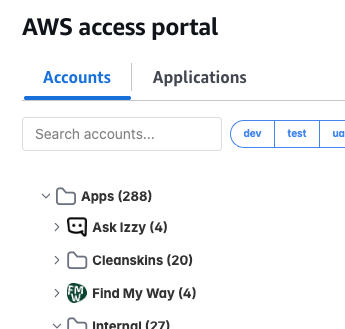
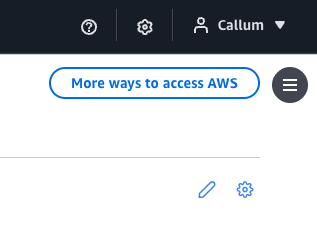
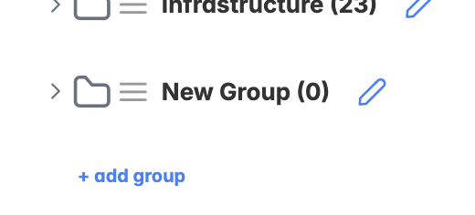
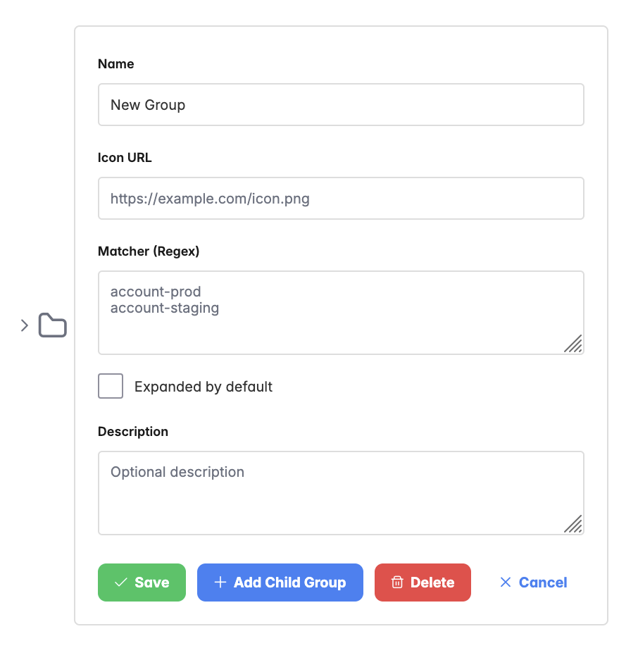

# AWS Launcher Organiser

[](https://chromewebstore.google.com/detail/aws-launcher-organiser/mpaanlhogigpcholciledcddbnanllii)
[](https://addons.mozilla.org/en-GB/firefox/addon/aws-launcher-organiser/)

A browser extension let you organise the list of accounts on your AWS account launcher page. Lets you group accounts
with custom matching rules and provide icons for each.



## How to use
To control how accounts are grouped click the pencil icon in the top right corner of the AWS start page.


 That will activate edit mode which should show an "+ add group" button above the list of accounts. Clicking this should
 create a new group and if you click the pencil icon next to this new group you should see some settings for that
 group. 
 
 
 
 
 
 The main one to be aware of is "Matcher (Regex)". This allows you to supply a regex and any accounts who's name
 is matched by this regex will be added to this group.
 
 So for example `-dev$` will match all accounts who's name ends in
 `-dev`. If the matches for multiple groups match an account then the account is added to the group that is most deeply
 nested (groups can be nested inside one another by dragging them when in edit mode). If multiple groups of the same depth match then the account is added to the group with the longest matching
 substring. So for example if the account `app-1-dev` is matched by a group with the matcher `-dev$` and a group with the
 matcher `.*` (and both groups are of the same nesting level) then the account will be added to the latter group.
 
 Tags can be added by clicking the settings cog icon in the top right corner and clicking "+ add tag". Tags use a
 similar regex matcher system to determine which accounts has that tag. However unlike groups accounts can have multiple tags.

## Development Process

### Prerequisites

- Node.js 16 or higher
- npm or yarn

### Installation

1. Clone the repository
2. Install dependencies:
   ```bash
   npm install
   ```

### Development

Start development mode with hot reload:

```bash
npm run dev
```

This will watch for changes and automatically rebuild the extension.

### Building

Build for all browsers:

```bash
npm run build:all
```

Build for specific browser:

```bash
npm run build:firefox
npm run build:chrome
```

### Linting and Formatting

Check code with Biome:

```bash
npm run lint
```

Auto-fix issues:

```bash
npm run lint:fix
```

Format code:

```bash
npm run format
```

## Project Structure

```
src/
├── content.ts        # Content script for AWS SSO page
├── background.ts     # Background service worker
├── components/       # React components
├── utils/           # Utility functions (account grouping logic)
└── entrypoints/     # Extension entry points
```

## Configuration

Account grouping rules can be configured in the extension settings. Define patterns to match account names and group them accordingly.

### Example Group Rules

```typescript
{
  "Production": ["prod", "prd"],
  "Development": ["dev", "development"],
  "Staging": ["stage", "staging", "stg"]
}
```

## License

MIT

## Contributing

Contributions are welcome! Please ensure code passes linting before submitting PRs.
