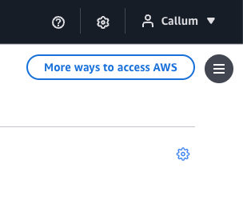

# AWS Launcher Organiser

A browser extension let you organise the list of accounts on your AWS account launcher page. Lets you group accounts
with custom matching rules and provide icons for each.


## How to use
To control how accounts are grouped click the blue cog icon in the top right corner of the AWS start page.


In the "Configuration (JSON)" field add your own configuration in the format of:
```JSON
[
  {
    key: "apps",
    name: "Apps",
    expandedByDefault: true,
    children: [
      {
        key: "app-1",
        name: "App 1",
        icon: "https://example.com/favicon.ico",
        matcher: "app-1-.*",
      },
      {
        key: "other-app",
        name: "Other App",
        matcher: "other-app-.*",
      },
    ],
  },
  {
    key: "sandboxes",
    name: "Sandboxes",
    matcher: [".*-sandbox"],
    expandedByDefault: true,
  },
  {
    key: "infrastructure",
    name: "Infrastructure",
    expandedByDefault: false,
    matcher: [
      "global-logging",
      "shared-service-.*",
    ],
  },
]
```

## Development Process

### Prerequisites

- Node.js 16 or higher
- npm or yarn

### Installation

1. Clone the repository
2. Install dependencies:
   ```bash
   npm install
   ```

### Development

Start development mode with hot reload:

```bash
npm run dev
```

This will watch for changes and automatically rebuild the extension.

### Building

Build for all browsers:

```bash
npm run build:all
```

Build for specific browser:

```bash
npm run build:firefox
npm run build:chrome
```

### Linting and Formatting

Check code with Biome:

```bash
npm run lint
```

Auto-fix issues:

```bash
npm run lint:fix
```

Format code:

```bash
npm run format
```

## Project Structure

```
src/
├── content.ts        # Content script for AWS SSO page
├── background.ts     # Background service worker
├── components/       # React components
├── utils/           # Utility functions (account grouping logic)
└── entrypoints/     # Extension entry points
```

## Configuration

Account grouping rules can be configured in the extension settings. Define patterns to match account names and group them accordingly.

### Example Group Rules

```typescript
{
  "Production": ["prod", "prd"],
  "Development": ["dev", "development"],
  "Staging": ["stage", "staging", "stg"]
}
```

## License

MIT

## Contributing

Contributions are welcome! Please ensure code passes linting before submitting PRs.
